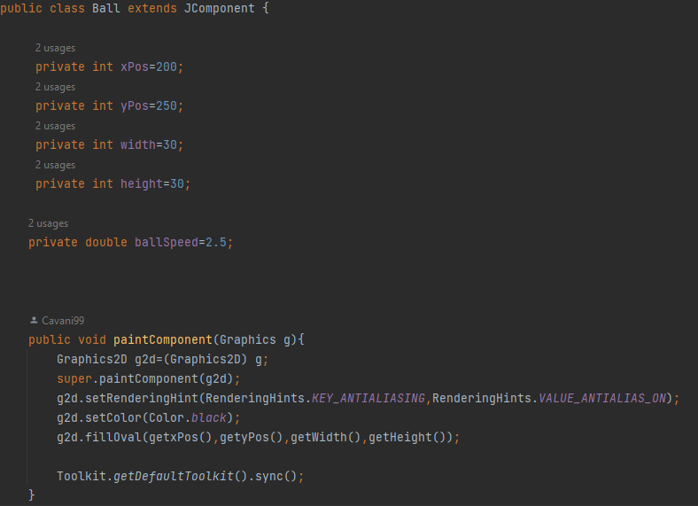
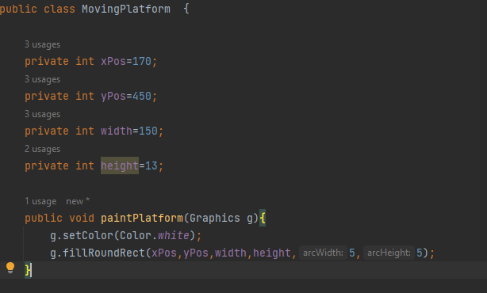
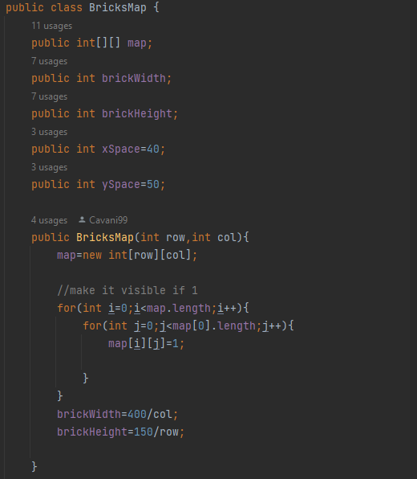
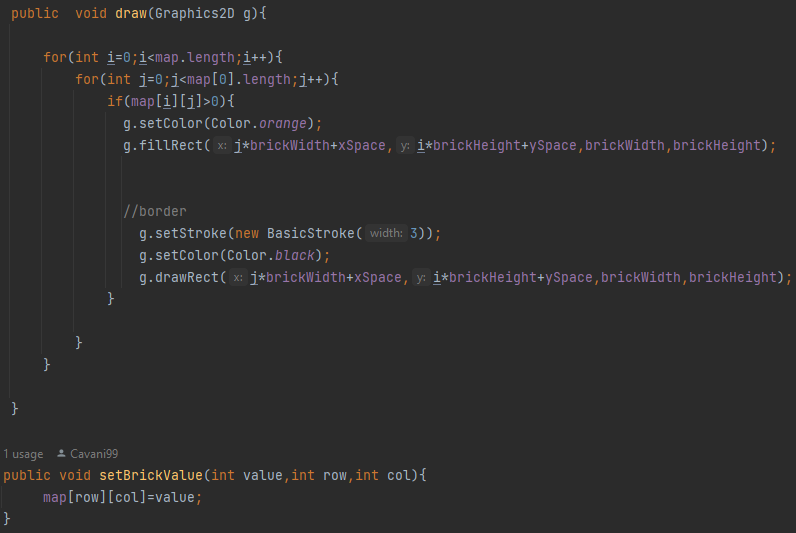
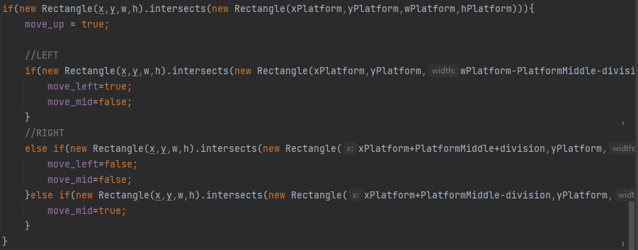
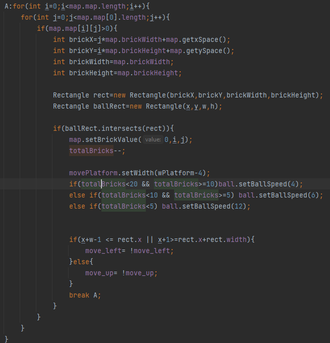
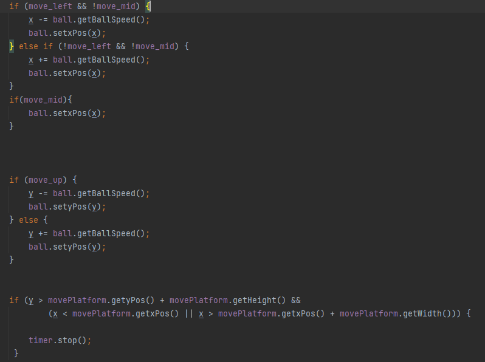
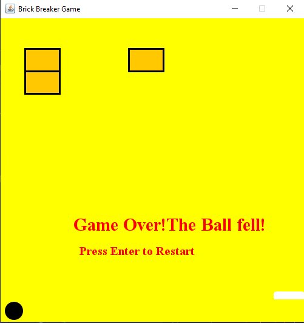
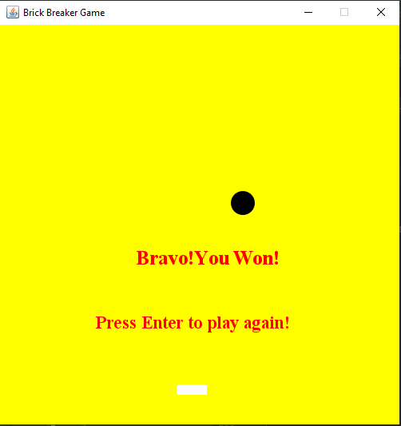

# BrickBreakerGame

## Short explanation 
A game where you have to break all the bricks using a ball and a moving platform.
The more bricks get destroyed ,the faster the speed of the ball and the platform gets smaller.

---
## Main and BrickFrame classes

The Main class just creates a new BrickFrame class.In the "BrickFrame" 
you create a window(JFrame) which will have all the resources(or mainly a Panel with all
the resources ,which are written in BrickPanel).

---
## BrickPanel class

Here is where all the action happens.A JPanel created in BrickFrame
which holds all the game objects and where the gameplay happens.
It uses Ball(the ball you are supposed to keep above the platform)
,MovingPlatform(the platform that you move to keep the ball) and 
BricksMap(all the bricks you have to break to win the game)classes.

### Starting screen

In the <b>PaintComponent</b> method you create the graphics for all the objects 
and the "Game Over" and "Game start" texts.

The class uses Action,Mouse and KeyListener.The MouseListener 
is used simply to move the platform and keep the ball up.

The KeyListener is also used for a simple job, to start or restart 
the game when its game over, or when you have not started it yet.
It only acts when the <b>ENTER</b> button is pressed.It also 
initialises the values for the ball,platform and bricksMap to their default
and start settings.

Now in the ActionListener is where all the objects interact.
A <b>Timer</b> is used to keep the game running constantly.
The initial delay value between events is 3 to keep the game not too fast
but also not too slow.

Before writing about the events happening in the <b>ActionListener</b>,lets first
explain the classes for the ball,platform and the map.

---
## Ball class

In this class we simply hold the size of the ball,the ball speed(with getters and setters) and paint method
for the graphics.

---
## MovingPlatform class

The same can be said about the platform,only difference is the
platform is a rectangle and the ball,an oval(obviously).

---
## BricksMap class

Here we make a map for the bricks you need to break with the ball.
The size of the map is based on the amount of rows and columns that 
the object is initialised with.Each brick is a rectangle with given
width and height,and initially holds a value of <b>1</b> and when it is 
hit its value equals 0 and is not drawn/painted anymore(its made invisible).

In the <b>setBrickValue</b> method we change the value of the given brick(mainly to 0).

---
## actionPerformed/BrickPanel

In this method we apply the movement of the ball and if it
intersects with the Platform,the Panel`s borders or any of
the bricks.That's what we use the booleans <b>move_left,move_mid and move_up</b>
for.I use the **division** variable to divide the platform in 3 parts,if
the ball hits the left,mid or right part it moves in the logical direction.

I use a double **for** loop to look if the ball makes a contact with
any brick and if the brick's value is more than **0**(it's not touched yet)
,the value of the brick is set to **0** and the **totalBricks** value(which holds the value of 
currently alive bricks)is decreased. I also decrease the width of the platform 
for a bigger difficulty and given the amount of bricks left, the speed of the ball is 
also increased(with the maximum speed being **12**).The idea was to make it really hard to win
,and in that way,make it more fulfilling when you do.

At the end of the method,we move the ball depending on the boolean 
values, and if the ball's coordinates are lower than the platform(or higher 
if we look at it from a different perspective)the game is stopped. 

---
### Game Over Screen

### Win Screen

---
## Ideas for Future upgrades

- Add levels
-  Add perks (when a brick is destroyed there will be a chance
for a random perk to fall,it could be more balls,bigger platform ,bigger ball ,etc).
-  Lives
- Sound
- More fair difficulty

