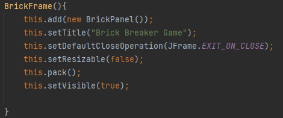
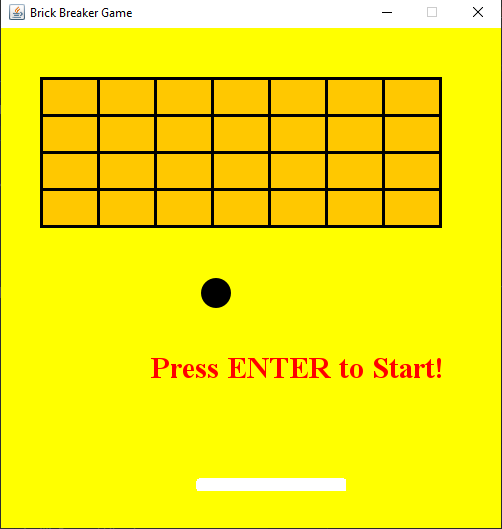
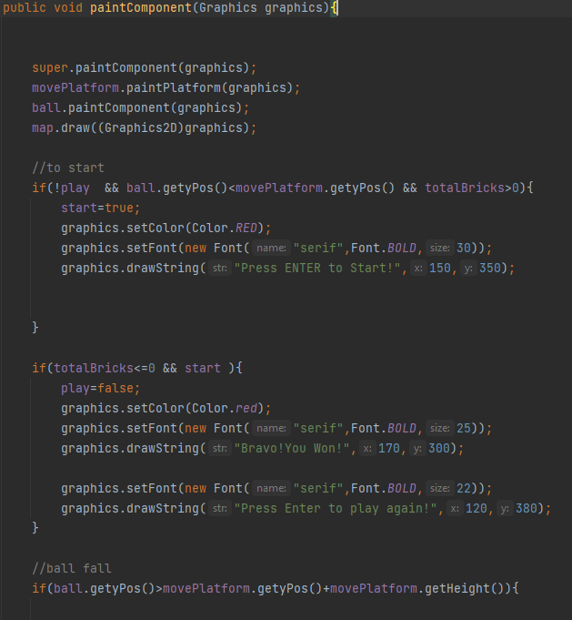
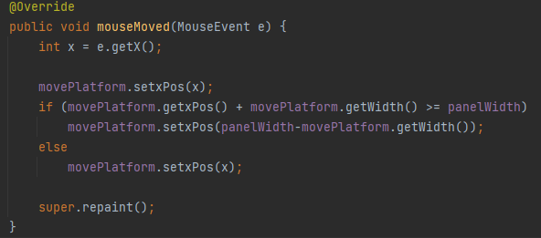
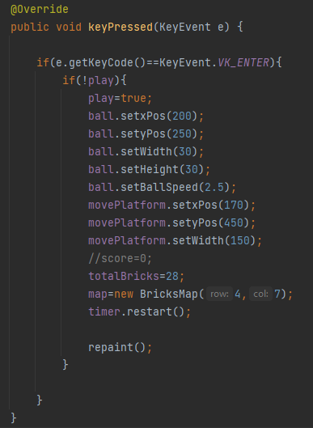

# BrickBreakerGame

## Short explanation 
A game where you have to break all the bricks using a ball and a moving platform.
The more bricks get destroyed ,the faster the speed of the ball and the platform gets smaller.

---
## Main and BrickFrame classes

The Main class just creates a new BrickFrame class.In the "BrickFrame" 
you create a window(JFrame) which will have all the resources(or mainly a Panel with all
the resources ,which are written in BrickPanel).

---
## BrickPanel class

Here is where all the action happens.A JPanel created in BrickFrame
which holds all the game objects and where the gameplay happens.
It uses Ball(the ball you are supposed to keep above the platform)
,MovingPlatform(the platform that you move to keep the ball) and 
BricksMap(all the bricks you have to break to win the game)classes.

### Starting screen

In the <b>PaintComponent</b> method you create the graphics for all the objects 
and the "Game Over" and "Game start" texts.

The class uses Action,Mouse and KeyListener.The MouseListener 
is used simply to move the platform and keep the ball up.

The KeyListener is also used for a simple job, to start or restart 
the game when its game over, or when you have not started it yet.
It only acts when the <b>ENTER</b> button is pressed.It also 
initialises the values for the ball,platform and bricksMap to their default
and start settings.

Now in the ActionListener is where all the objects interact.
A <b>Timer</b> is used to keep the game running constantly.
The initial delay value between events is 3 to keep the game not too fast
but also not too slow.

Before writing about the events happening in the <b>ActionListener</b>,lets first
explain the classes for the ball,platform and the map.

---
## Ball class

